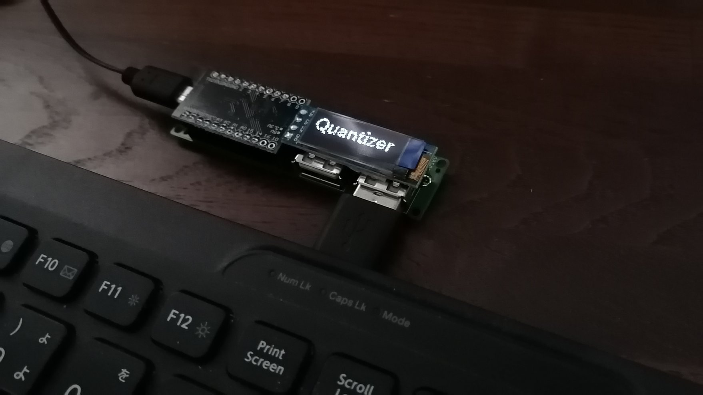

# Keyboard Quantizer
Keyboard Quantizerは一般的なUSBキーボードを自作キーボード用のファームウェアの定番であるQMKに対応させるためのボードです。キー配列を自由に変えられるだけでなく、キーボードにレイヤ、マクロ、コンビネーションなどの機能を追加できるようになります。

ファームウェアを開発することによってマウスなどその他のHID機器も接続できます。

|||
|-|-|
|rev1(rev2はPro Micro側にLCDを取り付けます)|rev3|

## 制約事項
簡単な仕組みとしては、
1. USBホスト用のマイコンがUSB機器と通信し
1. 受け取ったレポートをボード上のPro Microに送信
1. Pro Microはレポートから押されたキーを判定してQMK上の処理をする

といった流れになっています。

そのため、Fnキーなどのレポートとしては送信されないキーに反応することはできません。Fnキーと他のキーの組み合わせにより入力されるキー/音量調整などのレポートは受け取ることができます。

現時点で実装が完了しているファームウェアはキーボードから送信されるレポートがブートプロトコル(いわゆる6KROのこと。モディファイア+予約(1byte)+6キー分のデータを送信する)であることを前提としています。

この前提を満たさないキーボード(NKRO対応しているものなど)で使う場合にはファームウェアを改造する必要があります。

## ビルドガイド
- [rev2以前(Pro Microを乗せるタイプ)](rev2.md)
- [rev3(ケースに入ったタイプ)](rev3.md)
