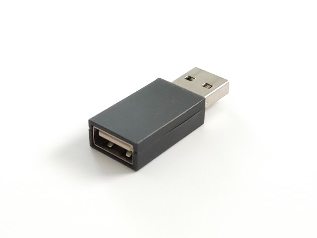

# Keyboard Quantizer

Keyboard Quantizerは一般的なUSBキーボードやマウスを自作キーボード用のファームウェアの定番であるQMKに対応させるためのボードです。キー配列を自由に変えられるだけでなく、キーボード/マウスにレイヤ、マクロ、コンビネーションなどの機能を追加できるようになります。

||
|-|

## 販売リンク

- [BOOTH](https://nogikes.booth.pm/items/4823647)
- [遊舎工房](https://shop.yushakobo.jp/products/7984)

## 制約事項

簡単な仕組みとしては、
1. USBホスト用のマイコンがUSB機器と通信し
1. 受け取ったレポートをボード上のPro Microに送信
1. Pro Microはレポートから押されたキーを判定してQMK上の処理をする

といった流れになっています。

そのため、Fnキーなどのレポートとしては送信されないキーに反応することはできません。Fnキーと他のキーの組み合わせにより入力されるキー/音量調整などのレポートは受け取ることができます。

既存のファームウェアで認識できないデバイスについてはファームウェアを改造して頂く必要があります。

## ビルドガイド

- [mini](mini/README.md)
- [rev2以前(Pro Microを乗せるタイプ)](rev2.md)
- [rev3(ケースに入ったタイプ)](rev3.md)
- [rev4(基板にKeyboard Quantize RPのシルクがある)](rev4.md)

## よくある質問

- xxキーボードで動きますか？
  - xxキーボードが手元にない場合は回答できません
    - HIDキーボードとして認識されるのであれば最終的にはQMKファームウェアを編集することで動作させられると思われます
