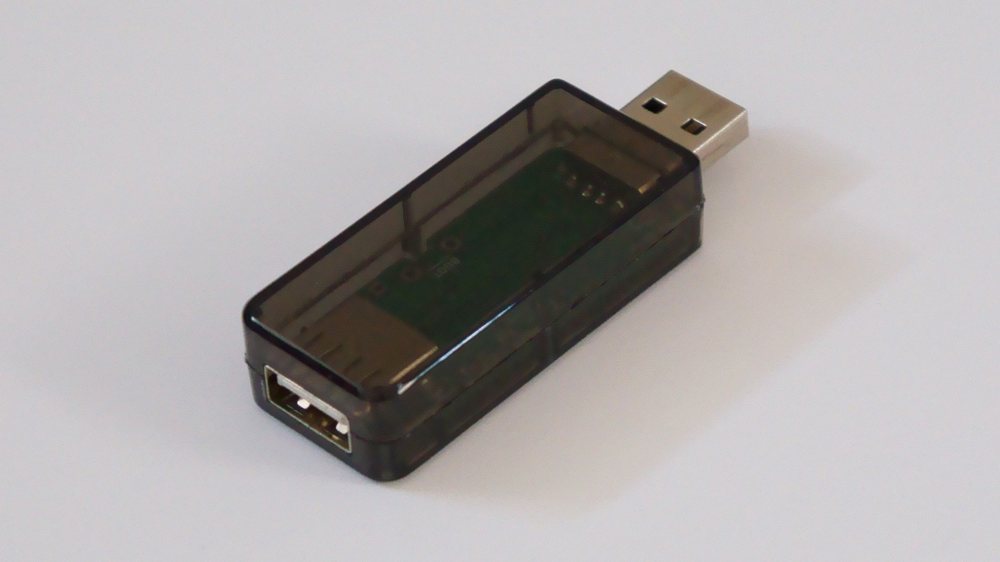
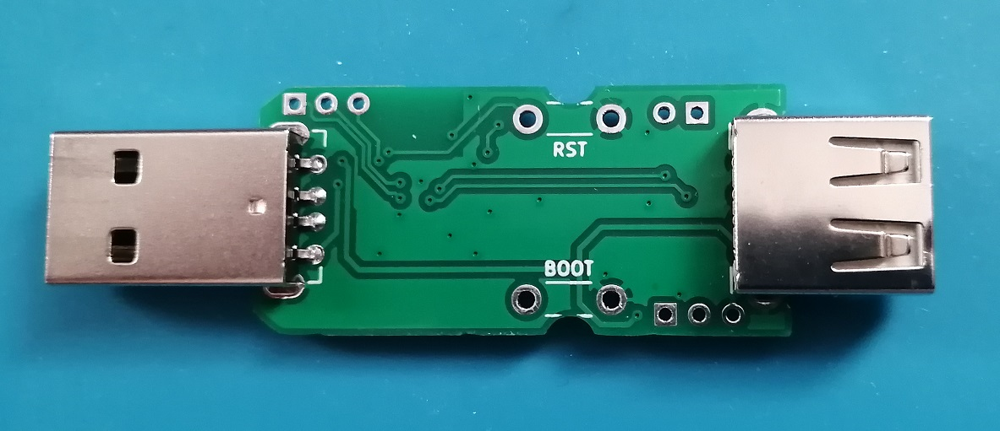
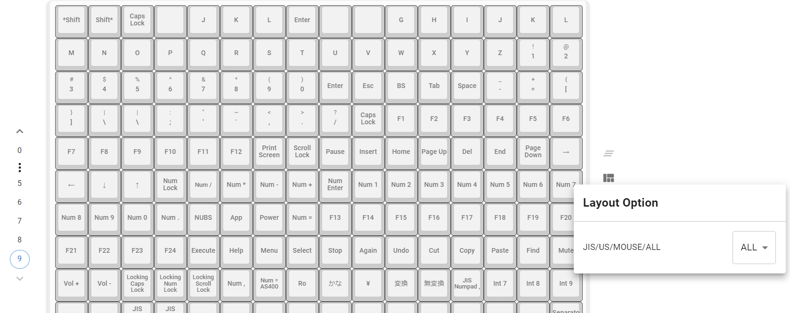

# Keyboard Quantizer ビルドガイド(Rev4)

Rev4はメインのMCUがatmega32u4からRP2040に変更されています。また、デフォルトのファームウェアでマウスの挙動変更にも対応しています。



- [販売リンク](#販売リンク)
- [はじめに](#はじめに)
- [組み立て手順](#組み立て手順)
  - [キット内容](#キット内容)
  - [組み立て](#組み立て)
  - [ファームウェアの書き込み](#ファームウェアの書き込み)
  - [動作確認](#動作確認)
  - [キーマップの書き換え](#キーマップの書き換え)
    - [マウスの設定を書き換える場合](#マウスの設定を書き換える場合)
  - [各種設定の変更](#各種設定の変更)
    - [Comboの設定](#comboの設定)
    - [Key overrideの設定](#key-overrideの設定)
- [ファームウェア](#ファームウェア)
  - [ビルド済みファームウェア](#ビルド済みファームウェア)
  - [QMKファームウェアの更新](#qmkファームウェアの更新)
  - [QMKファームウェアのビルド](#qmkファームウェアのビルド)
  - [ホスト用ファームウェア](#ホスト用ファームウェア)
  - [キーマップのオプション](#キーマップのオプション)
    - [レポートパーサの設定](#レポートパーサの設定)
    - [シリアルポート](#シリアルポート)
  - [ファームウェア更新履歴](#ファームウェア更新履歴)

## 販売リンク
- [BOOTH](https://nogikes.booth.pm/items/2256612)

## はじめに
- よくある質問は[こちら](README.md#よくある質問)
- 組立済版を購入された方は[動作確認](#動作確認)に進んでください
- 未組立版を購入された方はこのまま読み進めてください

## 組み立て手順
### キット内容
本キットには以下の部品が入っています

|部品|数量|
|--|--|
|メイン基板(表面実装部品実装済み) |1
|USBプラグ |1
|USBレセプタクル |1
|ケース |1

### 組み立て
- USBコネクタをはんだ付けしてください
  - コネクタは奥までしっかり差し込み、基板から浮いたり傾いたりしていないことを確認してください
  - **裏表逆にはんだ付けしないように注意してください。下の写真のように、電子部品が載っていない面からコネクタを差し込んでください**
- ケース中央部の丸い出っ張りと基板の切り欠きの位置が合うようにケースに入れます
  - はんだ付けに自信がない場合は後述のファームの書き込みと動作確認後にケースを閉めたほうが手戻りが少なく済みます
  
  
  
- ケースを開けるときはマイナスドライバーなど薄いものを側面の隙間にいれてこじ開けてください
  - 鋭利な工具を使用する場合は怪我に注意してください

### ファームウェアの書き込み

出荷時に書き込まれているファームウェアは最新版でない場合があります。下記手順に沿ってファームウェアを更新してください。

* QuantizerをPCに差し込んむ
* 適当なターミナルソフトからボーレート1200bpsの設定でQuantizerに接続する
  * 例えば[WebSerialPlotterをChromeで開き](https://sekigon-gonnoc.github.io/web-serial-plotter/)、baudrateを1200にして`OPEN`をクリック、ポップアップが表示されたらKeyboard Quantizerを選択して接続する。どれがQuantizerか分からない場合、ポップアップが出ている状態で抜き差しして、変化があったデバイスを選択する
* QuantizerとPCの接続が一度切断され、RPI-PR2という外部ストレージとして認識されていることを確認する
* [最新ファームのUF2ファイル](firmware/rev4/keyboard_quantizer_rp_default.uf2)をダウンロードし、外部ストレージにコピーする
* RPI-RP2が切断され、再度Quantizerとして認識されたら更新完了
  * ファームウェアによっては手動での抜き差しが必要です

### 動作確認
- キーボードをQuantizerに繋いでからPCに接続し、打鍵したキーがそのままPCに入力されることを確認してください
  - キーボードとの相性によってはこのファームウェアでは認識できない可能性があります
    - その場合、固定パーサファームウェアも試してみてください 

### キーマップの書き換え
- [Remap](https://remap-keys.app/)からキーマップを書き換えられます
  - Remapにアクセス
  - `START REMAP...` → `+KEYBOARD`の順にクリックし、ポップアップからKeyboard Quantizerを選択して接続
  - 右側のアイコン->Layout OptionからJIS/US/Mouseレイアウトを選択
    - 右上のアイコンでキーコードの表記もJIS/USにあわせて変更
    - JISにもUSにも表示されていないキーの割当を変更したい場合にはALLレイアウトを選択すると変更可能な全てのキーが表示されます
  - キーマップを変更したら右上のFlashから書き換え
    - **書き換え後30秒以上経過してからでないと書き換え結果が永続化しないため**、書き込み直後にPCから取り外す場合は注意してください

#### マウスの設定を書き換える場合
- マウスのボタンの割り当てを変更したい場合はRemapでレイアウトからMouseを選択してください。レイアウトに表示されているキーはそれぞれ下記に対応します
  - 一番上の列: ボタン1~8
  - 左下の4つ: 簡易ジェスチャ(左上、左下、右下、右上)
  - 右下の4つ: マウスホイール(スクロール、パン)
- 簡易ジェスチャ機能はLTやMOでレイヤ移動した状態でカーソルを動かしてから元のレイヤに戻った時に実行されます
- Remap上ではHoldにレイヤ移動を、Tapにマウスボタンを指定することができます。ボタン4, 5の用に通常は長押ししないボタンと組み合わせることでボタン数が少ないマウスでもレイヤ機能を活用できます

### 各種設定の変更

- [Keyboard Quantizer Configurator](https://sekigon-gonnoc.github.io/keyboard-quantizer-configurator/) を使って閾値や動作を変更できます。このサイトはChromeかEdgeでのみ動作します。

|項目|内容|
|-|-|
|default layer|0~7に変更できます|
|key override|JP配列のキーボードをUS設定のOSに繋いだり、US配列のキーボードをJP設定のOSにつないだときに印字通りに入力できるようになります|
|Use last layer as combo setting|最終レイヤの設定内容をもとにQMKの[Combo](https://docs.qmk.fm/#/feature_combo?id=combos)を設定できます（詳細は後述）|
|Tapping term|60~340msの間で20ms刻みで設定できます|
|Use simple parser|接続したキーボードを6KROと決め打ちして入力を認識します|
|Mouse gesture|マウス向けの簡易ジェスチャ機能の閾値を10~150pxの間で10px刻みで設定できます|
|Swap XXXX|QMKのSwap XXXX を設定できます|

- `Enable per host OS config` にチェックを入れることで、これらの設定をQuantizerの接続先OS（Win, Mac, Linux, その他）によって切り替えられます

#### Comboの設定

Keyboard Quantizer Configuratorで  `Use last layer as combo setting` を有効にすると最終レイヤのキーマップをコンボの設定に変換できます

- RemapでLayout optionを`ALL`にする
- 左上から順にコンボに使用するキーの組み合わせ、コンボが発動したときに入力するキー、KC_NO（RemapだとNOOP）と並べていきます。KC_NOを2個並べると以降のキーは無視されます
- 例えば LSHIFT+RSHIFT -> CAPS LOCK, J+K+L -> Enter と設定するには下記のようにします。

- Reampでキーマップを書き換えたあとQuantizerを再起動するか、Cobmo on/off/toggle のいずれかのキーを押すことでコンボ設定に反映されます

#### Key overrideの設定

- Func01を押すことでUS keyboard on JP OS, Func02を押すことでJP keyboard on US OSを設定することもできます
- 無効にする場合はFunc0を押してください
- これらのキーはRemap上では `SPECIAL`タブのFUNCグループから選択できます

**以上で使用する準備は完了です。もっと細かくキーボードの挙動を変えたい場合にはQMKファームウェアを書き換える必要があります**

## ファームウェア
### ビルド済みファームウェア

||説明|
|-|-|
|[初期ファームウェア](firmware/rev4/keyboard_quantizer_rp_default.uf2)| 初期状態のファームウェアです。接続したUSB機器のディスクリプタを解析して認識しようとしますが、うまくいかない場合もあります。マウスを認識することもできます|
|~~固定パーサファームウェア~~|~~6KROのキーボードと決め打ちして入力を認識します。初期ファームウェアではうまく認識できないキーボードが認識できる場合があります。マウスは認識できません~~ Keyboard Quantizer Configurator を使ってsimple parser を有効化してください|

上記のファームウェアでうまくいかない場合(非対応のポインティングデバイス内臓キーボードなど)はファームウェアを改造する必要があります

### QMKファームウェアの更新
パーサの種類を初期設定から変えたいときなど、QMKファームウェアを更新する場合には下記手順でRP2040のファームウェアを更新してください

- QuantizerをPCに差し込むとシリアルデバイスとして認識されることを確認してください
- RP2040のUF2ブートローダを起動してUSBストレージとして認識させます。ブートローダは次のどちらかの手順で起動します
  - シリアルデバイスに1200bpsで接続する
  - 1200bps以外の速度で接続し`b`を送信する
- UF2ファイルをコピーしてファームウェアを更新する

### QMKファームウェアのビルド
- rev4はRP2040を内蔵しています。書き込むファームウェアは[このリポジトリ](https://github.com/sekigon-gonnoc/qmk_firmware/tree/dev/sekigon)のrp2040ブランチです

    ```bash
        # qmk_quantizerというフォルダ名でリポジトリをクローン
        git clone https://github.com/sekigon-gonnoc/qmk_firmware.git -b rp2040 qmk_quantizer
        # クローンしたディレクトリに移動
        cd qmk_quantizer
        # submoduleを取得
        make git-submodule
        # uf2ファイルを生成する場合
        make keyboard_quantizer/rp:default:uf2
        # picotoolで書き込む場合
        make keyboard_quantizer/rp:default:flash
    ```

### ホスト用ファームウェア

- Rev4はホスト用ファームウェア書き込み済みで出荷しています。Rev3向けとはファームウェアが異なるため、間違えて書き込まないように注意してください
  - https://github.com/sekigon-gonnoc/CH559sdccUSBHost/tree/quantizer_ex
  - 書き込みには[ch559update.py](https://github.com/sekigon-gonnoc/keyboard-quantizer-doc/blob/master/ch559update.py) を使用してください
  ```bash
  ./ch559update.py flash -p /dev/ttyACM0 -f CH559USB_1_1_0.bin -b
  ```


### キーマップのオプション
#### レポートパーサの設定

デフォルトのファームで目的のデバイスが認識できない場合はkeymap.cに独自のパーサを実装してください。[解説](user_parser.md)|

#### シリアルポート
- シリアルポートからデバッグ情報を読み出したりブートローダを起動したりできます
  |コマンド|機能|
  |-|-|
  |d|デバッグ出力有効化|
  |b|ブートローダ起動|

### ファームウェア更新履歴

- 0.1.4
  - 疑似US/JP配列を設定可能にする
  - 最後のレイヤをコンボ設定に変換するオプションを追加
  - Tapping termやマウスジェスチャの閾値を変更可能にする
  - 接続先OSの判定を追加
  - Keyboard Quantizer Configuratorに対応
- 0.1.3
  - マウスボタンをLT()に入れたときの挙動を修正
- 0.1.2
  - マウスホイールに動作を割り当てたとき、モディファイヤをリリースするタイミングを遅延させる
